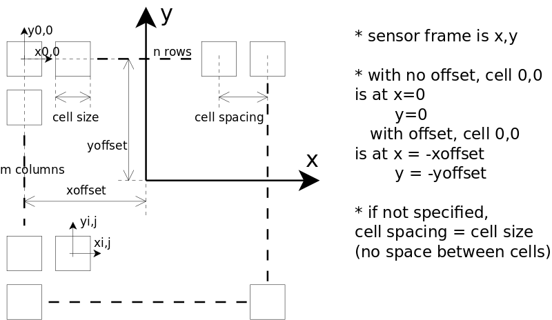

urdf_tactile
============

## Overview

This packages contains an extension to URDF to describe tactile sensors along with a corresponding parser plugin.

It requires modified versions of [`urdf`](https://github.com/ubi-agni/urdf) and [`urdfdom`](https://github.com/ubi-agni/urdfdom).

It is based on an XML syntax compatible with ```<sensors>``` and is meant to describe various types of tactile sensors
with a set of parameters such as :

* list of taxels
* array of taxels
* taxel
  - geometry
  - position/orientation wrt sensor frame
  - data channel/index

It is related to the [`tactile_msgs`](../tactile_msgs/README) format, when accessing/producing the data vector.

## XML syntax

### Array of identical rectangular taxels

```xml
<sensor name="my_tactile_sensor" [group="mygroup"] update_rate="100">
   <parent link="my_tactile_mount"/>
   <!-- z-axis represents the normal of the grid array -->
   <origin xyz="0 0 0.034" rpy="0 0 0"/>
   <tactile channel="data_channel">
     <!-- 
          size: size of an individual taxel
          spacing: distance between taxels centers, equals size by default, can be negative for flipping
          offset: position offset of taxel grid (relative to origin), with no offset, grid frame is at center of cell 0,0
     -->
     <array rows="16" cols="16" order="row-major|column-major"
            size="0.005 0.005" [spacing="0. 0."] [offset="0. 0."]/>
   </tactile>
 </sensor>
```

see image for easier understanding of the parameters describing an array



### List of taxels

```
<sensor name="my tactile_sensor" [group="fingertip"] update_rate="100">
   <parent link="my_tactile_mount"/>
   <origin xyz="0 0 0" rpy="0 0 0"/>
   <tactile channel="data_channel">
     <!--
          idx is the index of the data value in the data vector on the selected channel (~topic)
          xyz and rpy is the pose of the taxel center wrt sensor frame,
          z-axis represents the normal of the taxel

     -->
     <taxel idx="0" xyz="0.01 0.01 0" rpy="0 0 0">
      <!--
            geometry defines the taxel shape (used for marker display)
            might require a small scale extension of 1% larger than the mesh to avoid overlay of the robot mesh
        -->
       <geometry>
         <mesh filename="package://sensor_description/model/my_tactiles/tax_lower.stl" scale="0.00101 0.00101 0.00101"/>
       </geometry>
     </taxel>
     <taxel idx="1" xyz="0.02 0.01 0" rpy="0 0 0">
       <geometry>
         <mesh filename="package://sensor_description/model/my_tactiles/tax_upper.stl" scale="0.00101 0.00101 0.00101"/>
       </geometry>
     </taxel>
  </tactile>
</sensor>
```

Note: the channel parameter permits to access the data vector of the same sensors->name in a _tactile_msgs::tactile_state_, at different indices but use them in different sensors
